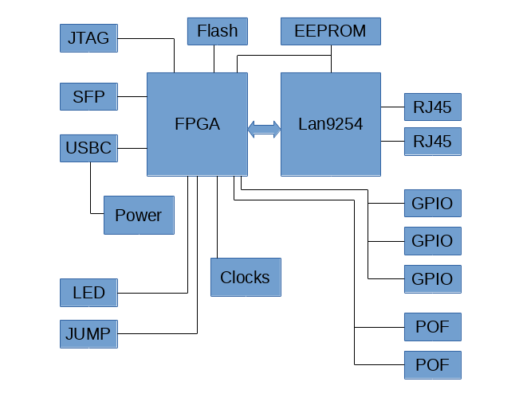

# EtherCat EVR Prototype

Prototype board of the EtherCat EVR. This is intended to be a
ESC implemented in an FPGA along with a Event Receiver.
Power is supplied to this board via a USB-C (from a compatible port
or power-supply/wal-wart).

At the core of this board is an Artix-7 FPGA which connects to an SFP
from where it receives the timing-system event stream. A 16-bit
parallel interface is connected to a LAN9254 EtherCat controller
device which implements the low-level EtherCat functionality and
drives a twin RJ-45 fast-ethernet connector (EtherCat bus).

## Hardware Features
The board hosts the following hardware:

  - Artix-7 FPGA (xc7a35; note that this was the only device I could
    actually buy in 2022. Was able to secure the last 2 (!) chips from
    Mouser.
  - Configuration flash device.
  - Microchip LAN9254 EtherCAT controller. I also could only secure this
    device via Microchip's sample program (thanks!). At a cost of ~$10
    it is cheaper and faster to use this controller rather than developing
    logic and implementing it in a (bigger!) FPGA device.
  - Twin RJ-45 connector for EtherCAT. They are connected to the LAN9254
    controller.
  - EtherCAT ESC EEPROM. This holds the EtherCAT ESI data and embedded
    ("vendor-specific") non-volatile application parameters. These can
    be modified without having to regenerate a FPGA image/bitstream.
  - SFP cage connected to an Artix-7 MGT.
  - Renesas programmable VersaClock 6 clock generator (one of very few clock
    chip I could get a hand on in 2022). This is used as a refererence clock
    for the EVR MGT as well as a general-purpose clock for FPGA logic.
  - Three LVTTL GPIO ports.
  - Two POF I/O ports (these can drive an LED pulse-id display that can
    e.g., be used to verify camera real-time operation).
  - Several LEDs and jumpers.
  - Power-converters are fed from a single USB-C connector. The power-supply
    can be disabled from an FPGA-pin. This allows the user to implement
    features such as a watchdog or remote-control to self-power cycle the
    system.
  - USB-2 FIFO interface to FPGA (FTDI FT240).
  - JTAG interface connected to FPGA and (optionally) the LAN9254.
    Initial configuration of the FPGA (blank configuration flash) must be
    performed via this interface.
